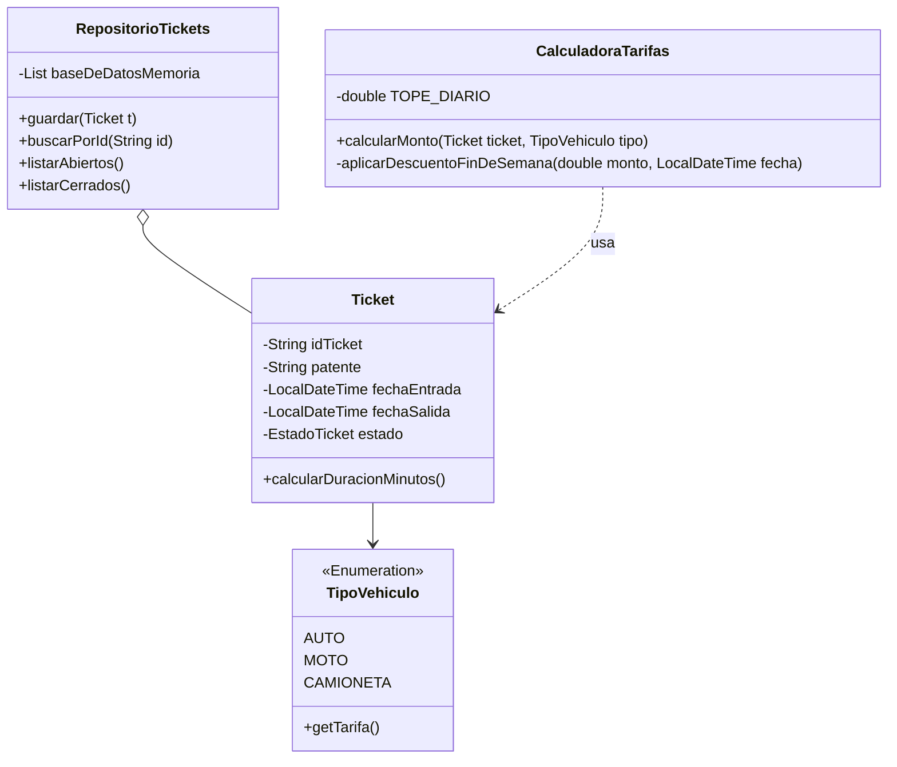

# Calculadora de Tarifas de Estacionamiento 🚗

Sistema de gestión de cobros de estacionamiento por consola (CLI) desarrollado en Java 21. El proyecto implementa lógica de negocio para tarifas diferenciadas por vehículo, cobro por tramos de 30 minutos, topes diarios y descuentos de fin de semana.

## 📋 Descripción del Diseño

El diseño sigue una arquitectura orientada a objetos (POO) limpia, separando las entidades de dominio, la lógica de negocio y la interfaz de usuario. con la arquitectura msc

Se uso gradle ya que lo habia implementado en otro proyecto.


## Ejecución

dirigirse a la carpeta de Tarea_2 y ejecutar lo siguiente

```
.\gradlew build
```


```
.\gradlew run --console=plain
```


```
.\gradlew clean test
```

con esto en la siguiente ruta queda la cobertura de los test en la siguiente ruta

```
./build/report/jacoco/test/html/index.html
```
### Diagrama de Clases (UML)



## Consideraciones

Actualmente se considera un tope de 15000, aunque hayan pasado mas de un dia. Si por ejemplo esta desde el 01/12/2025 a 04/12/2025 se considera como tope 15000, no se considera un tope por dia sino por ticket.

## Cobertura

Se medio la cobertura y resulta en:
- Models: 52% sentencia y 34% branches
- main: 0% sentencia y 0% branches
- Service: 97% sentencia y 90% branches

Para los test unitarios no se considero realizar en main, puesto que esta como para mostrar los datos y pedir por consola, tiene super poca logica.

En caso de los otros se probaron la logica de los modelos y service, esta dio una cobertura muy buena para los servicios para branches o sentencia.

En caso de los resultados del model esto se debe a que no se probo funciones como toString, get y set, ya que estas son triviales y no considere importante a la hora de probar.

En base a lo mencionado, el programa tiene una gran cobertura de test en las partes importantes del programa lo que ayuda a que hayan menor cantidad de bugs.